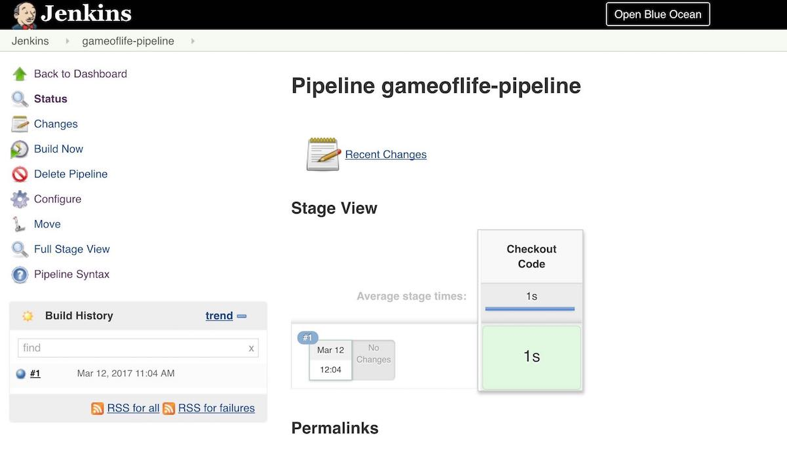
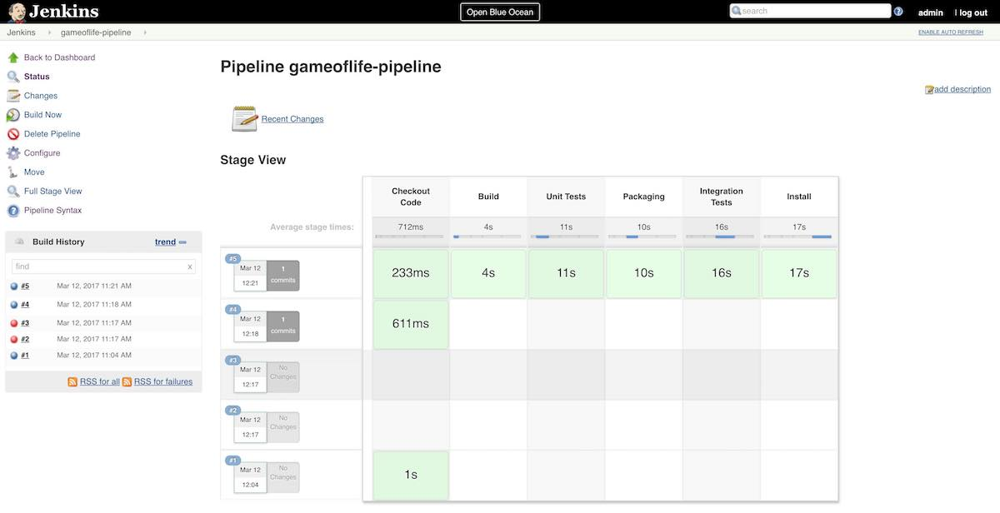
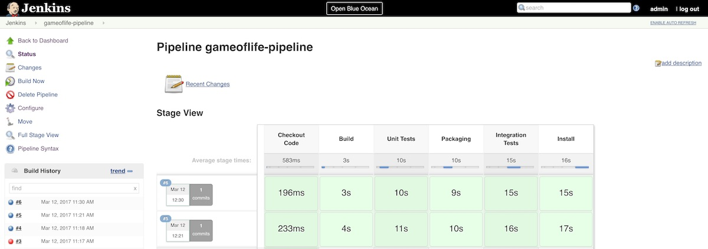
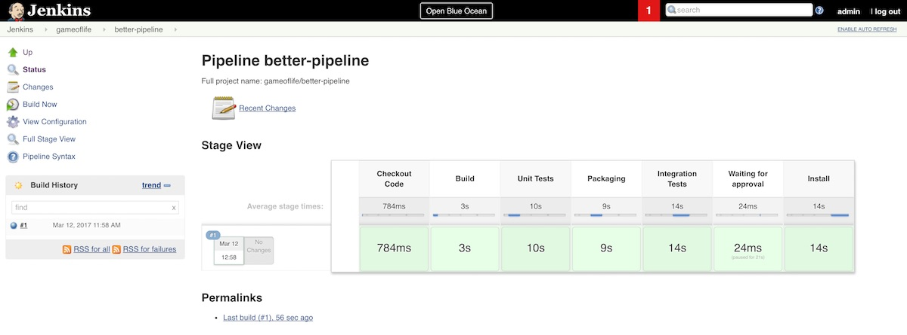

# Snow Camp IO 2017 (Grenoble) - FR

Ce dépôt contient les slides et le lab de la session
"Bâtissons ensemble un pipeline avec Jenkins et Docker"

## Slides

La présentation est accessible:

* Sur Slideshare (PDF): https://www.slideshare.net/legrimpeur/snowcamp-io-grenoble-2017-btissons-ensemble-un-pipeline-avec-jenkins-et-docker
* Sur mon site GitHub Pages (HTML): http://dduportal.github.io/presentations/snowcampio-2017/
* Dans le dossier ["slides"](./slides) (Sources)

## Lab

Le Lab correspond aux étapes montrée pendant la session.

### Pré-requis: Démarrer la VM

Les éléments suivants doivent être installés au préalable :

* VirtualBox 5.1.x (https://www.virtualbox.org/)
  - But: Permettre le fonctionnement d'une VM
* Vagrant 1.9.x (https://www.vagrantup.com/)
  - But: Piloter la VM de manière automatique et partageable

L'usage d'une VM permet:

* D'éviter de perturber votre environement de travail
* De nettoyer "correctement" une fois le lab terminé
* De fournir un environement stable et reproductible
* Mais entraîne un surcoût de performance


Ouvrir un terminal et saisir les commandes suivantes:

```bash
# Vérifier la version et l'installation de Vagrant
$ vagrant -v
# Installer la VM localement (~1 Go à télécharger, 1 seule fois)
$ vagrant box add jenkins-lab https://github.com/dduportal/snowcampio-2017/releases/download/1.1.0/snowcampio-2017.box
# Création d'un répertoire de travail et initialisation du projet
$ mkdir snowcamp-jenkins-lab && cd snowcamp-jenkins-lab \
  && vagrant init -m -f jenkins-lab
# Vérification en lisant le contenu du fichier Vagrantfile généré
$ cat Vagrantfile
...

# Démarrage de la VM
$ vagrant up
...
```

Une fois la VM démarrée, les services suivants sont démarrés
et accessibles :

* Un serveur Web pour la page d'accueil: [http://localhost:10000](http://localhost:10000)
* Une instance Jenkins (authentification: admin / snowcampio2017): [http://localhost:10000/jenkins/](http://localhost:10000/jenkins/)
* Un serveur "[Gitea](https://gitea.io/)" (un fork de [Gogs](https://gogs.io/)) pour héberger le code localement: [http://localhost:10000/gitserver/](http://localhost:10000/gitserver)
* Une ligne de command "DevBox" en HTML: [http://localhost:10000/devbox](http://localhost:10000/devbox)
  - Pour garantir une configuration unifiée et reproductible avec java et Maven

Ces services fonctionnent avec docker et docker-compose dans la VM:
tout est stocké dans /var/customize et /var/lib/docker.

### Démo Application GameOfLife - Maven & Java

Afin de comprendre l'usage de Jenkins, voici un exercice
permettant de maîtriser l'application de démo.

* Ouvrir le service "DevBox" à l'adresse [http://localhost:10000/devbox](http://localhost:10000/devbox)
  - Une ligne de commande apparaît
* Saisir la séquences de commandes suivante :

```bash
# Vérification de la présence des outils requis (java, maven git)
bash-4.3# java -version
...
bash-4.3# mvn -v
...
bash-4.3# git --version
...

# Récupération de l'application de démo
bash-4.3# git clone https://github.com/wakaleo/game-of-life
...

# Exécution des commandes mvn, cf. slides pour intention
bash-4.3# cd game-of-life/
bash-4.3# ls -l # pom.xml => Projet Maven
# cf - https://maven.apache.org/
# Essayer de rejouer chaque command 2 fois: La 1ère télécharge des dépendances
bash-4.3# mvn clean
bash-4.3# mvn compile
bash-4.3# mvn test
bash-4.3# mvn package
bash-4.3# mvn verify
bash-4.3# mvn install
...
bash-4.3# mvn -pl gameoflife-web jetty:run
# Application accessible sur http://localhost:9090
# Utiliser CTRL + C pour quitter
```

### Démarrer avec Jenkins

* Ouvrir Jenkins à l'adresse [http://localhost:10000/jenkins/](http://localhost:10000/jenkins/)
* Authentification: admin / snowcampio2017
  - cf. [./lab/jenkins/ref/init.groovy.d](./lab/jenkins/ref/init.groovy.d)
* Naviguer dans **Manage Jenkins** -> **Configure System**
  - Vérifier que *# of executors* est à zéro
* Naviguer dans **Manage Jenkins** -> **Manage Nodes** et créer un nouvel agent:
  - Nom: `maven-agent`
  - Label: `maven3-jdk8`
  - "Remote root directory": `/home/jenkins`
  - Launch Method: "Launch slave agent with SSH"
  - Hostname: maven-agent
  - Clef: Utiliser le credential "agent-ssh-key"
* Naviguer dans **Manage Jenkins** -> **Global Tool Configuration**
  - Ajouter une nouvelle installation Maven nommée `maven3`, en mode automatique
* Récupérer l'adresse du dépôt Git local "gameoflife":
  - Depuis la page d'accueil [http://localhost:10000](http://localhost:10000)
  - Naviguer dans le **Gitserver**
  - Aller dans **Explore** -> **dev:gameoflife**
  - Copier l'URL en haut à droite, prêt du bouton "HTTP" bleuté, avec le bouton qui va bien
* Créer un job freestyle
  - Nom: `gameoflife-freestyle`
  - Configurer le SCM sur le dépôt "gameoflife local", sand Credential
  - Utiliser "gogs" pour le "Repository Browser" avec l'adresse du dépôt sans le ".git" à la fin
  - Build Step: Invoke a top level Maven, avec l'installation `maven3` et le goal `clean install`
  - Lancer un build manuellement
* Configurer un webhook depuis le dépôt local "gameoflife":
  - Authentification dans [http://localhost:10000/gitserver](http://localhost:10000/gitserver) avec dev / dev
  - Accéder aux réglages "hooks" du dépôt git local: http://localhost:10000/gitserver/dev/gameoflife/settings/hooks
  - Ajouter un WebHook de type "Gitea", avec la paylod URL sur http://localhost:10000/jenkins/gogs-webhook/?job=gameoflife-freestyle, avec un trigger sur "I need everything"
  - Tester les webhook: un 2nd build doit être lancé
* Visualiser un job en erreur + les changements associés:
  - Via le dépôt local dans Gitea, naviguer sur le fichier `gameoflife-core/src/main/java/com/wakaleo/gameoflife/domain/Cell.java` et cliquer sur le stylo "Edit" en haut à droite
  - Modifier ligne 4 `DEAD_CELL(".");` en `DEAD_CELL("-");` et enregistrer.
  - Un nouveau build est lancé tout seul (grâce au webhook), son résultat sera "failed" car les tests ne passeront pas
  - Corriger l'erreur ensuite, enregistrer, un nouveau build est lancé, retour  à la normale
  - Visualiser la page du job, naviguer dans les menus "Recent Changes", et cliquer sur le liens "gogs" pour voir les différence dans le dépôt Gitea


### Pipeline "Scripted" Simple

Un premier Pipeline Jenkins "scripted" (utilisant Groovy + DSL) :

* Créer un nouveau Job de type "Pipeline", nommé `gameoflife-pipeline`
* Options par défaut
* Pipeline Définition: *Pipeline script* (aka. inline, saisi directement dans l'interface)
  - Ce n'est pas l'idéal: utilisation à des fin pédagogiques ici
* Utiliser le lien *Pipeline Syntax* pour ouvrir le générateur de "snippet" pour le pipeline (URL: http://localhost:10000/jenkins/job/gameoflife-pipeline/pipeline-syntax/ )
* Exercice : Créer un pipeline qui va cloner le dépôt et afficher le contenu de la racine du dépôt
* Indices: mots clefs à utiliser : `node`, `stage`, `git` et `sh`

<details>
  <summary>Solution :</summary>
  <p>
    <a href="snippets/pipeline-01.groovy">Cliquer pour voir snippets/pipeline-01.groovy</a>
    
  </p>
</details>

### Pipeline "Scripted" avec Jenkinsfile

* Objectif 1: Déplacer le script Pipeline dans le dépôt Git (plutôt que dans Jenkins)
* Configuration du job `gameoflife-pipeline` à changer: *Pipeline script from SCM*
  - Configurer pour pointer sur le dépôt local git `gameoflife`
  - Le build doit planter: pas de Jenkinsfile présent
* Dans Gitea:
  - Modifier le WebHook pour pointer sur `gameoflife-pipeline`  au lieu de `gameoflife-freestyle`
  - Créer un nouveau fichier `Jenkinsfile` à la racine du dépôt (utiliser le bouton bleu *New File* en haut, au centre)
  - Le remplir avec le contenu de l'exercice précédent
* Grâce au webhook, le build a dû se construire avec succès
* Exercice : éditer le `Jenkinsfile` afin de résoudre les éléments suivants:
  - Eviter la répétition de configuration Git entre la configuration du job et le pipeline
  - Implémenter des étapes de Pipeline pour la compilation Maven
  - Les commandes Maven doivent utiliser l'installation "maven3"
* Indices : mots clefs à utiliser: `checkout scm`, `stage`, `def mvnHome = tools (...)` et `sh`

<details>
  <summary>Solution :</summary>
  <p>
    <a href="snippets/pipeline-02.groovy">Cliquer pour voir snippets/pipeline-02.groovy</a>
    
  </p>
</details>

### Amélioration du Pipeline: Simplification des commandes et Utilisation de plugin "pipeline-isé"

* Objectifs:
  - Simplifier les commandes Maven en utilisant des variables d'environnement
  - Utiliser un plugin compatible Maven pour la phase "Maven install" afin de voir une 2nd façon de faire
* Exercice : Modifier le `Jenkinsfile` afin que toutes les commands `sh` appellent la commande `mvn` simplement, sans préciser d'élément avant. Ceci vous impose de supprimer la définition de variable `def ... = tools`
  - Utiliser le plugin https://wiki.jenkins-ci.org/display/JENKINS/Pipeline+Maven+Plugin pour l'étape "Install"
  - Utiliser la gestion des variables d'envrionnements, en ajoutant l'emplacement de Maven dans la variable d'environnement "PATH"
* Indices : mots clefs à utiliser : `withEnv` et `withMaven`

<details>
  <summary>Solution :</summary>
  <p>
    <a href="snippets/pipeline-03.groovy">Cliquer pour voir snippets/pipeline-03.groovy</a>
    
  </p>
</details>

### MultiBranch Pipeline + Workflow complexe

* Objectifs:
  - Utiliser le mode recommandé "MultiBranch Pipeline" pour implémenter le
  "Pipeline as Code" avec un "Github flow "(fork, review, merge)
  - Appliquer ce workflow sur une amélioration du Pipeline pour intégrer une validation manuelle dans l'IHM de Jenkins
* Exercice :
  - Créer un nouveau job Jenkins de type "MultiBranch Pipeline", nommé `gameoflife` .
  - Configuration: utiliser **Add Source** -> **Git** -> faire pointer sur le dépôt `gameoflife` local comme précédemment
  - Modifier le WebHook pour pointer sur cette URL: http://localhost:10000/jenkins/job/gameoflife/build?delay=0
  - Etudier le job: un dossier a été créé avec un job pipeline "master" dedans, automatiquement
  - Créer une nouvelle branche nommée `better-pipeline`, en utilisant la devbox:

```bash
rm -rf gameoflife
git clone http://localhost:10000/gitserver/dev/gameoflife.git
cd gameoflife
git checkout -b better-pipeline
touch .dummy-decoy
git add .
git config --global user.email "dev@localhost.com"
git config --global user.name "Dev"
git commit -m "Init branche better-pipeline"
git push origin better-pipeline
# Authenticate with dev / dev
```

  - Dans Gitea, éditer le fichier `Jenkinsfile` sur la nouvelle branch (recharger la page si besoin). Il faut implémenter une validation manuelle avant l'étape "Install"
  - Si aucune validation manuelle n'intervient avant 120 secondes, le build doit s'arrêter en status "failed"
  - Pour voir les validation de pipeline, utilisez le "Console Output", ou cliquer sur l'étape visuelle pour faire apparaitre le popup (ou utiliser BlueOcean)
* Indice: mots clef à utiliser: `stash`, `unstash`, `timeout` et `input`

<details>
  <summary>Solution :</summary>
  <p>
    <a href="snippets/pipeline-04.groovy">Cliquer pour voir snippets/pipeline-04.groovy</a>
    
  </p>
</details>
