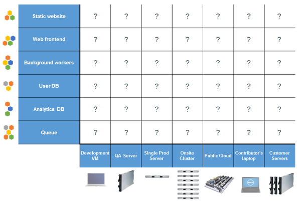

Titre: snowcamp-io-2017-batissons-ensemble-un-pipeline-avec-jenkins-et-docker
name: normal
layout: true
---
class: center, middle, inverse
# SnowCamp IO 2017:
## Bâtissons ensemble un pipeline avec Jenkins et Docker

---

# Whoami :

* Damien DUPORTAL
  - Training Engineer @ [CloudBees](https://www.cloudbees.com) depuis 1 an
  - 6 ans à [Atos Worldline](http://worldline.com/fr/accueil.html): Production, Dev, Training, etc.
  - Intervenant ponctuel à [EPSI](http://www.epsi.fr/), [ENSG](http://www.ensg.eu/), [CNAM](http://www.cnam.fr/)
  - Docker mentor, depuis v0.3
  - Grimpeur


* Contact:
  - Mail/Hangouts: <damien.duportal@gmail.com>
  - Professionel: <dduportal@cloudbees.com>
  - Github: [dduportal](https://github.com/dduportal)
  - Twitter: [@DamienDuportal](https://twitter.com/DamienDuportal)

---
class: center, middle, inverse
# Who are you ?

---

# Agenda:

1. Jenkins 2, quoi de neuf ?
2. Démo: Un petit tour du propriétaire
3. Débutons avec les pipelines
4. Vous avez dit Docker ?
5. Jenkins et Docker ensemble
6. Futur: BlueOcean et Declarative Pipelines


Code et Lab disponibles ici: https://github.com/dduportal/snowcampio-2017

---
class: center, middle, inverse
# DISCLAIMER

---
class: center, middle, inverse

# Jenkins 2, quoi de neuf ?

<br />


---
.left-column[
# Jenkins 2, quoi de neuf ?
## Pourquoi Jenkins 2 ?
]
.right-column[

# Pourquoi Jenkins 2 ?

* Jenkins 1 a(vait) + 10ans
    - 1.658:
        + acegi-security:1.0.7 — Avril 2008
        + spring-core:2.5.6 — Octobre 2008

* Parce que l’intégration continue a évolué
  - jenkins-ci.org !?

* slave ➞ agent

* "Fire and forget"

]
---
.left-column[
# Jenkins 2, quoi de neuf ?
## Pourquoi Jenkins 2 ?
## Objectifs
]
.right-column[

# Objectifs

* **Message:** CI -> CD
  - CD = Continuous Delivery

.center[

]
* Transition douce: Pas de rupture avec Jenkins 1
  - Montée de version simple
  - Tous les plugins restent compatible (~)

* Expérience première utilisation

* **Pipeline-as-Code** en première ligne

]
---
.left-column[
# Jenkins 2, quoi de neuf ?
## Pourquoi Jenkins 2 ?
## Objectifs
## Assistant
]
.right-column[
# Assistant

.center[

]

]
---
.left-column[
# Jenkins 2, quoi de neuf ?
## Pourquoi Jenkins 2 ?
## Objectifs
## Assistant
]
.right-column[
# Assistant

.center[

]

]
---
.left-column[
# Jenkins 2, quoi de neuf ?
## Pourquoi Jenkins 2 ?
## Objectifs
## Assistant
]
.right-column[
# Assistant

.center[

]

]
---
.left-column[
# Jenkins 2, quoi de neuf ?
## Pourquoi Jenkins 2 ?
## Objectifs
## Assistant
]
.right-column[
# Assistant

.center[

]

]
---
.left-column[
# Jenkins 2, quoi de neuf ?
## Pourquoi Jenkins 2 ?
## Objectifs
## Assistant
]
.right-column[
# Assistant

.center[

]

]
---
.left-column[
# Jenkins 2, quoi de neuf ?
## Pourquoi Jenkins 2 ?
## Objectifs
## Assistant
## Pipeline-as-Code
]
.right-column[
# Pipeline-as-Code

* Le dépôt code comme seul source de vérité
  - Fichier _Jenkinsfile_ avec le code source
  - C'est le dévelopeur qui spécifie comment construire son application

* Un monde de DevOps: Jenkins ne devient pas "openbar"
  - Pensez à vos admins !

* Type de jobs dédiés:
  - Pipeline
  - Multibranch
  - Organisations (Github / BitBucket)

* "Citoyen de 1ère classe": le futur de Jenkins est centré sur les Pipelines

]
---
.left-column[
# Jenkins 2, quoi de neuf ?
## Pourquoi Jenkins 2 ?
## Objectifs
## Assistant
## Pipeline
## \*.jenkins.io
]
.right-column[
# \*.jenkins.io

.center[

<https://jenkins.io>
]


* Moderne
* Collaboratif
* Documentation et tutoriels

]
---
.left-column[
# Jenkins 2, quoi de neuf ?
## Pourquoi Jenkins 2 ?
## Objectifs
## Assistant
## Pipeline
## \*.jenkins.io
]
.right-column[
# \*.jenkins.io

* Avez-vous déjà essayé de chercher un plugin ?
* ... une documentation de plugin ?

.center[
## Tout nouveau, tout beau:

<https://plugins.jenkins.io>]

]
---
.left-column[
# Jenkins 2, quoi de neuf ?
## Pourquoi Jenkins 2 ?
## Objectifs
## Assistant
## Pipeline
## \*.jenkins.io
## Futur: Backend Storage
]
.right-column[
# Futur: Backend Storage

.center[]
]
---
.left-column[
# Jenkins 2, quoi de neuf ?
## Pourquoi Jenkins 2 ?
## Objectifs
## Assistant
## Pipeline
## \*.jenkins.io
## Futur: Backend Storage
## Futur: BlueOcean
]
.right-column[
# Futur: BlueOcean

.center[

<https://jenkins.io/projects/blueocean/>
]

* Repenser l'expérience **utilisateur** de Jenkins
* Nouvelle IHM écrite en [ReactJS](https://facebook.github.io/react/)
* Conçu pour les **Pipelines** (compatible Freestyle)

]
---
.left-column[
# Jenkins 2, quoi de neuf ?
## Pourquoi Jenkins 2 ?
## Objectifs
## Assistant
## Pipeline
## \*.jenkins.io
## Futur: Backend Storage
## Futur: BlueOcean
]
.right-column[
# Futur: BlueOcean

.center[

]

* Visualiser son Pipeline
* Etapes, logs, métriques, statut

]
---
.left-column[
# Jenkins 2, quoi de neuf ?
## Pourquoi Jenkins 2 ?
## Objectifs
## Assistant
## Pipeline
## \*.jenkins.io
## Futur: Backend Storage
## Futur: BlueOcean
]
.right-column[
# Futur: BlueOcean

.center[

]

* Identifier immédiatement les problèmes
* Retour d'information **rapide**

]
---
.left-column[
# Jenkins 2, quoi de neuf ?
## Pourquoi Jenkins 2 ?
## Objectifs
## Assistant
## Pipeline
## \*.jenkins.io
## Futur: Backend Storage
## Futur: BlueOcean
]
.right-column[
# Futur: BlueOcean

.center[

]

* Personnalisation de son interface

]
---
.left-column[
# Jenkins 2, quoi de neuf ?
## Pourquoi Jenkins 2 ?
## Objectifs
## Assistant
## Pipeline
## \*.jenkins.io
## Futur: Backend Storage
## Futur: BlueOcean
]
.right-column[
# Futur: BlueOcean

.center[

]

* Gestion native des branches, pull-requests
* Compatible Github et Bitbucket APIs (feedbacks)

]
---
class: center, middle, inverse

# Démo: Un petit tour du propriétaire
---
.left-column[
# Tour du propriétaire
## Game Of Life
]
.right-column[

# Game Of Life

* Code original: <https://github.com/wakaleo/game-of-life>

* Implémentation web du ["Jeu de la Vie de J. H. Conway"](https://fr.wikipedia.org/wiki/Jeu_de_la_vie)

* Jeu "zéro joueur"
  - On défini l'état initial de la grille de cellule
  - Puis on lance et on observe

* Règles:
  - Une cellule morte possédant exactement trois voisines vivantes devient vivante.
  - Une cellule vivante possédant deux ou trois voisines vivantes le reste, sinon elle meurt.

]
---
.left-column[
# Tour du propriétaire
## Game Of Life
## Maven & Java
]
.right-column[

# Maven & Java

* Application écrite en Java
  - Compatible JDK 7 et 8

* Cycle de vie de l'application géré par [Maven](https://maven.apache.org/)
  - Description du projet avec un fichier `pom.xml`
  - Gestion des dépendances
  - Stockage dans le dépôt `${HOME}/.m2/repository`
  - Ligne de commande pour exécuter des "goals"
  - Orienté convention: dossier `target`

* Avec un JDK 8 et Maven 3.3.9 dans votre PATH:
  - Nettoyer le projet: `mvn clean`
  - Compiler le projet: `mvn compile`
  - Tests unitaires: `mvn test`
  - Tests d'intégration: `mvn verify`
  - Empaqueter l'application: `mvn package`
  - Installer les paquets dans le dépôt local: `mvn install`

.center[
## [Action Time - click me](https://github.com/dduportal/snowcampio-2017#démo-application-gameoflife---maven--java)
]

]
---
.left-column[
# Tour du propriétaire
## Game Of Life
## Maven & Java
## Run It
]
.right-column[

# Run It

* Sous-projet `gameoflife-web`

* Artefact généré: un fichier `.war`

* Nécessite un serveur d'application (Tomcat, JBoss, Jetty)

* Lancement avec Maven :
```
mvn -pl gameoflife-web jetty:run
```
  - Accessible sur http://localhost:9090

.center[
## [Action Time - click me](https://github.com/dduportal/snowcampio-2017#démo-application-gameoflife---maven--java)
]

]
---
.left-column[
# Tour du propriétaire
## Game Of Life
## Maven & Java
## Run It
## Jenkins It
]
.right-column[

# Jenkins It

* Jenkins préconfiguré: <https://github.com/dduportal/snowcampio-2017>

* Jenkins agent:
  - Rien ne dois tourner sur le master (sécurité)
  - Scaler facilement la fonction "build"
  - Builder sur des cibles spécifiques

* Jenkins exécuteur:
  - Emplacement "virtuel" atomique pour une tâche
  - Est fourni par les agents et le master
  - Règle de _départ_ : ~1 exécuteur par CPU

.center[
## [Action Time - click me](https://github.com/dduportal/snowcampio-2017#démarrer-avec-jenkins)
]

]
---
class: center, middle, inverse

# Débutons avec les pipelines

---
.left-column[
# Débutons avec les pipelines
## Avantages
]
.right-column[

# Avantages par rapport au Freestyle

* "Configuration as code"
  - Historisation
  - Gestion des conflits
* Gestion du parallélisme simple
* Syntaxe Dynamique (plugins)

* Documentation et tutoriels: https://jenkins.io/doc/book/pipeline/

]

---
.left-column[
# Débutons avec les pipelines
## Avantages
## Pipeline "simple"
]
.right-column[

# Pipeline "simple"


## [Action Time - click me](https://github.com/dduportal/snowcampio-2017#pipeline-scripted-simple)

]

---
.left-column[
# Débutons avec les pipelines
## Avantages
## Pipeline "simple"
## Pipeline et plugins
]
.right-column[

# Pipeline et plugins


## [Action Time - click me](https://github.com/dduportal/snowcampio-2017#amélioration-du-pipeline-simplification-des-commandes-et-utilisation-de-plugin-pipeline-isé)

]

---
.left-column[
# Débutons avec les pipelines
## Avantages
## Pipeline "simple"
## Pipeline et plugins
## Multibranch Pipeline
]
.right-column[

# Multibranch Pipeline


## [Action Time - click me](https://github.com/dduportal/snowcampio-2017#multibranch-pipeline--workflow-complexe)

]

---
class: center, middle, inverse

# Docker 101
## Vous avez dit Docker ?
---
.left-column[
# Docker: 101
## Pourquoi Docker ?

]
.right-column[

# Pourquoi Docker ?

Quel est le problème que nous essayons de résoudre ?

.center[]

]
---
.left-column[
# Docker: 101
## Pourquoi Docker ?

]
.right-column[

# "Matrix from Hell"

Problème de temps **exponentiel**

.center[]

]
---

.left-column[
# Docker: 101
## Pourquoi Docker ?

]
.right-column[

# Déjà vu ?

L'IT n'est pas la seule industrie à résoudre des problèmes...

.center[]

]
---
.left-column[
# Docker: 101
## Pourquoi Docker ?

]
.right-column[

# Solution: Le container intermodal
.center[]
.center["Separation of Concerns"]

]
---
.left-column[
# Docker: 101
## Pourquoi Docker ?
## Comment ça marche ?
]
.right-column[

# Comment ça marche ?

.center["Virtualisation **Légère**"]

.center[]

]
---

.left-column[
# Docker: 101
## Pourquoi Docker ?
## Comment ça marche ?
]
.right-column[

# Comment ça marche ?

* Linux Kernel requis (ou presque... Windows...)
* Linux containers: "super" chroot
  - "Namespacing": isolation (users, réseau, PIDs ...)
  - "Control Groups": gestion et contrôle (CPU, mem ...)
* Système de fichier de type "Union File System"
* Process **PID 1** et ses enfants _dans_ le container

.center[]

]
---
.left-column[
# Docker: 101
## Pourquoi Docker ?
## Comment ça marche ?
## Docker workflow
]
.right-column[

# Docker workflow

Workflow Docker basique:

.center[]

]
---
.left-column[
# Docker: 101
## Pourquoi Docker ?
## Comment ça marche ?
## Docker workflow
## Docker Inc.
]
.right-column[

# Docker Inc.

* Fondé à Paris en 2008 par Solomon Hykes
* Migre à San Fransisco en 2009
* 2013: Open-source le projet Docker
* 2014: dotCloud devient Docker
* 2016: 1 milliard de levée de fond

# Docker Project

* Originellement écrit en Python au sein de dotCloud
* Ré-écrit en **Golang** et _ouvert_ en 2013 après une "PyCon"
* Open Source - [Apache licence](https://github.com/docker/docker/blob/master/LICENSE)
* Disponible sur Github: https://github.com/docker/docker
* ~22 K commits, +1400 contributeurs

]
---
.left-column[
# Docker: 101
## Pourquoi Docker ?
## Comment ça marche ?
## Docker workflow
## Docker Inc.
## Résumé
]
.right-column[

# Résumé

_Objectif de Docker :_

.center[]

]
---
.left-column[
# Docker: 101
## Pourquoi Docker ?
## Comment ça marche ?
## Docker workflow
## Docker Inc.
## Résumé
]
.right-column[

# Container are NOT VMs

"Separation of concerns": 1 "tâche" par containeur

.center[]

]
---
.left-column[
# Docker: 101
## Pourquoi Docker ?
## Comment ça marche ?
## Docker workflow
## Docker Inc.
## Résumé
]
.right-column[

# VM et containeurs non exclusifs mutuellement

.center[]

]
---
class: center, middle, inverse

# Jenkins et Docker ensemble
---
.left-column[
# Jenkins et Docker ensemble
]
.right-column[

# Cas d'usages

* Docker comme outil de build
* Docker comme environnement de build
* Docker pour les agents
* Docker pour le master

]
---
class: center, middle, inverse

# Futur: BlueOcean et Declarative Pipelines
## Il est frais mon Pipeline !

* https://jenkins.io/projects/blueocean/
* https://jenkins.io/doc/pipeline/tour/hello-world/

---
class: center, middle, inverse
# Merci !
## Questions ?
